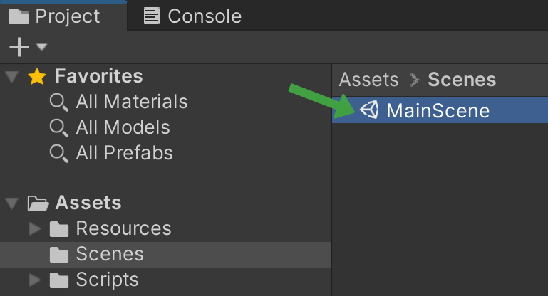

# DoEarMi - Musical Ear Training App
> DoEarMi is a mobile application that assists beginner musicians in practicing identifying pitch by ear in different contexts. Musicians use pitch identification to compose music as well as gather inspiration from music, and it takes time and practice to train one’s ear to identify pitch correctly. Ear training can be difficult for beginners who may not have much knowledge of music theory, but we believe a lack of music theory knowledge should not hinder musical pursuits. We address these challenges in DoEarMi with ear training lessons to get familiar with foundational concepts as well as practice sessions for chords, intervals, scale degrees, and melodic diction. Users complete practice sessions to earn XP for climbing the leaderboard and credits for spending in the shop. While our project is similar to existing applications, we focus more on beginner musicians and an emphasis on gamified components to encourage continuous practice.

DoEarMi is a high fidelity prototype with its core features fully implemented. Users can create and log into an account where their progress, item collections, and credits are saved and loaded. Navigating to the lessons page, users can learn terms and pitch identification tips with both written explanations and audio examples. Users can then put their knowledge to the test in practice sessions and see a detailed breakdown of their accuracy scores and earnings. Credits earned from practice sessions can be spent in the shop on new profile icons, new instruments to use as audio in practice sessions, and various XP boosters. Users who earn enough XP will see themselves at the top of the leaderboard.

## Downloads 

[Check out our Android build here!](https://github.com/raleighsedona/DoEarMi/releases)

## Development Setup

#### Recommended Tools:
- Unity v2020.3.18f1 LTS
  - Android Module

#### Development setup steps:
- Clone this repository
- Open the Unity Hub
  - You may need to manually add the project to Unity Hub via the Open drowndown
  - Select the root directory of this repo as the project to open
- Ensure that the project using Unity v2020.3.18f1 in the editor version dropdown
- Launch the project
- In the project window, open the main scene in Assets > Scences > MainScene.unity

<!-- Markdown link & img dfn's -->
[license-image]: https://img.shields.io/github/license/raleighsedona/DoEarMi?style=for-the-badge
[stars-image]: https://img.shields.io/github/stars/raleighsedona/DoEarMi?style=for-the-badge

