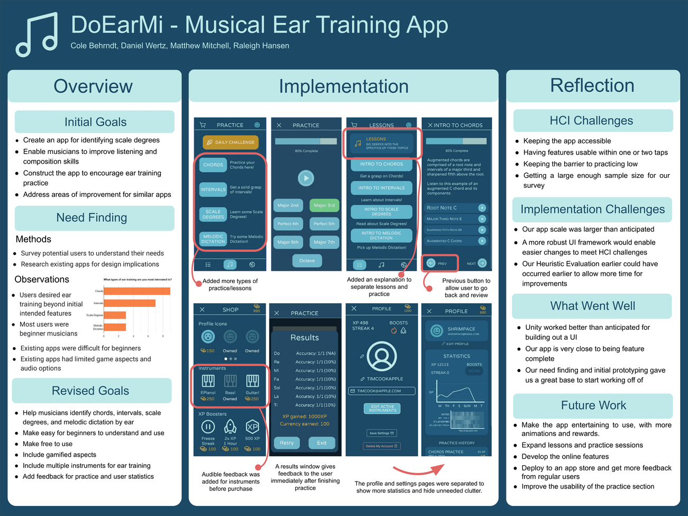
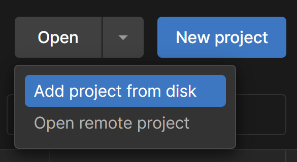
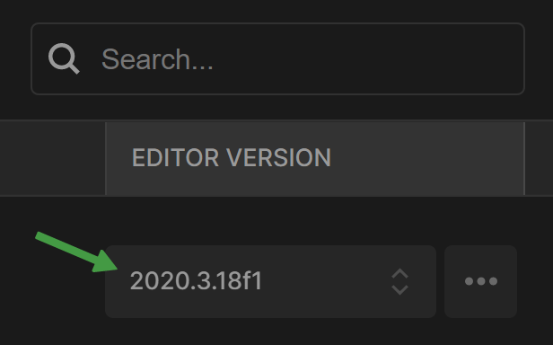

# DoEarMi - Musical Ear Training App
> The goal of our project is to develop a web application to assist users in practicing identifying scale degrees by ear. This could be limited to Major scale, or be expanded to include other commonly used scales, such as Natural/Harmonic Minor. We also aim to include practice sessions focusing on melodic dictation if our relatively short time frame allows it. Our system could provide the user with scale degree lessons, practice exercises, or tests/quizzes. While our project is similar to existing apps, we will make some tweaks to focus more closely on scale degrees, while keeping it easy and pleasant to use (see Relevant Systems section for more detail).

![License][license-image]  ![Stars][stars-image]

DoEarMi is a mobile application that assists beginner musicians in practicing identifying pitch by ear in different contexts. These contexts include chords, intervals, scale degrees, and melodic dictation. Our desire to create such an app stems from the importance of pitch identification for musicians. Musicians use pitch identification to compose music as well as gather inspiration from music, and it takes time and practice to train one’s ear to identify pitch correctly. Ear training can be difficult for beginners who may not have much knowledge of music theory, but we believe this lack of music theory knowledge should not hinder their musical pursuits. We address these challenges in DoEarMi with ear training lessons to get familiar with concepts, practice sessions for the contexts previously described, as well as gamified elements and progress tracking to encourage regular ear training.

## Development setup

#### Recommended Tools:
- Unity v2020.3.18f1 LTS
  - Android Module

#### Development setup steps:
- Clone the repo
- Open the repo using Unity Hub
  - You may need to manually add the project to Unity Hub via the Open drowndown

- Ensure that the project using Unity v2020.3.18f1 in the editor version dropdown

- The project should now run.

<!-- Markdown link & img dfn's -->
[license-image]: https://img.shields.io/github/license/raleighsedona/DoEarMi?style=for-the-badge
[stars-image]: https://img.shields.io/github/stars/raleighsedona/DoEarMi?style=for-the-badge

